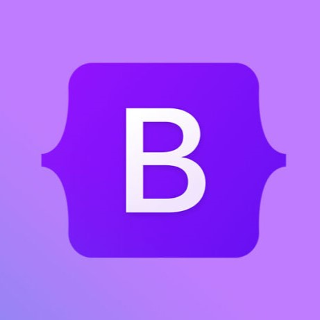

## Underscore Functions Part Two

Bootstrap 5 is literally Underscore functions but with style. This course is the first course I am currently taking that introduced me to the world of web designing; with that said, Bootstrap 5 is also the first framework I have ever used. With my past experiences of coding, I thought Bootstrap 5 is like another library that can make your code look cleaner and easier to work with. Instead of working with functions this time it's classes, since the coding language is HTML and CSS. Without Bootstrap 5, your text editor would be very cluttered and hard to understand with all the lines of code all over the place.

## Learning a New Language While Learning a New Language

It's true; just like learning about libraries and implementing them into your code, using frameworks when designing a website is like a whole new language. You would need to to know new functions and new variables. Sometimes you can't even create a variable since it already exists within that framework or library. Initially, I had trouble alligning divs since the Bootstrap classes were quite hard to understand. But as I parcticed more and more with practice WODs, I was able to find a pattern which allowed me to finish the WOD much faster than what I had expected.

## Overall Good

Raw HTML and CSS won't only make your website look old, but coding it will also be very hard and time consuming. By implementing frameworks, you can make your coding style look cleaner and easier to understand. It's like ESLint all over again. But this time, with Underscore functions. By doing practice WODs it became like a second language. It's literally like a second language.

