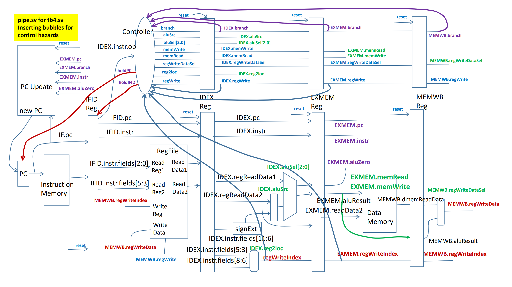

In this lab we learned about digital design. At the start of the semester we have reviewed the SystemVerilog language using FPGA boards since we should have already covered the basics in EE260: Intro to Digital Designs. This course was very challenging but enjoyable at the same time. We coded an FPGA board multiple times where one of the projects was to create an ALU circuit where the switches from the FPGA board are used as inputs while the LEDs are used as the output. This purpose of the ALU was to either add, subtract, perform a logical OR or AND the two given four bit inputs from the switches.

In the near end of the semester when we were more comfortable with SystemVerilog, we have created a five staged pipeline processor that stalls to avoid data and control hazards. To do so, the computer shall stall if there is a branch or conditional branch instruction downstream in the pipeline. The controller is able to check for a branch or unconditional branch by using the "branch" signal aat each of the stages. "Bubbles" would be inserted when there is a branch-type instruction in the EX, MEM, and WB stages. The program counter and IFID registers will also hold their values since the process is currently stalling. This project was very challenging but a bit enjoyable and made me consider about working in this field of computer engineering.
